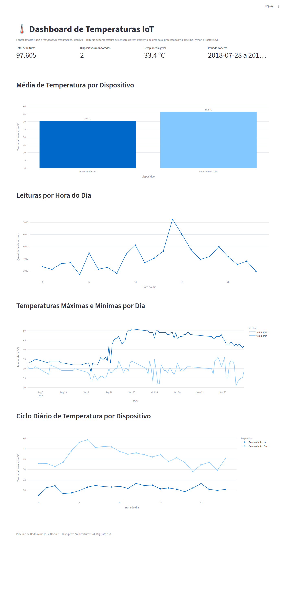
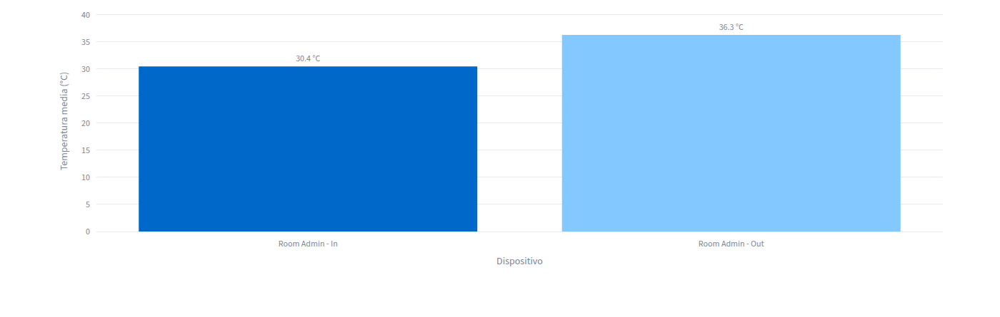
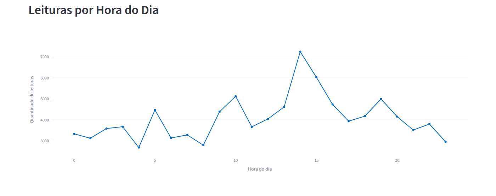
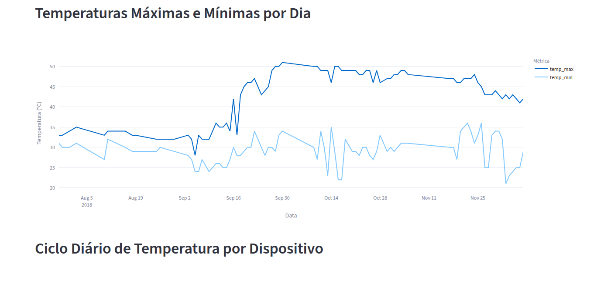
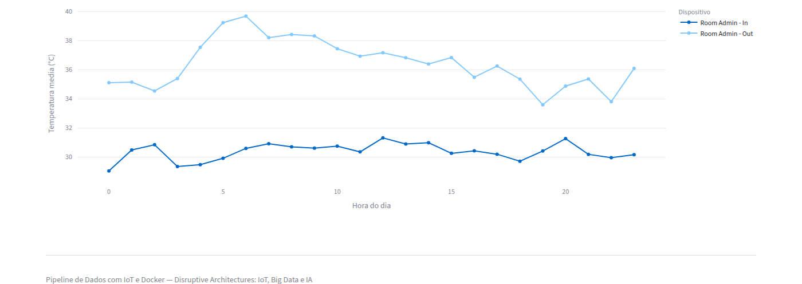

# Pipeline de Dados com IoT e Docker

Pipeline completo que processa leituras de temperatura de dispositivos IoT
(dataset Kaggle *Temperature Readings: IoT Devices*) e as armazena em um
banco de dados PostgreSQL rodando em Docker, com views SQL de análise e um
dashboard interativo em Streamlit.

Projeto da disciplina **Disruptive Architectures: IoT, Big Data e IA**.



## Tecnologias utilizadas

- **Python 3** — ETL (pandas) e dashboard (Streamlit + Plotly)
- **PostgreSQL 16** — banco de dados relacional, rodando em container Docker
- **Docker / docker-compose** — orquestração do banco de dados
- **SQLAlchemy** — conexão e execução de SQL a partir do Python
- **Streamlit + Plotly** — dashboard web interativo

## Estrutura do projeto

```
.
├── data/
│   └── IOT-temp.csv          # dataset (Kaggle - Temperature Readings: IoT Devices)
├── docs/
│   └── screenshots/          # capturas de tela do dashboard
├── sql/
│   └── views.sql             # views SQL de análise
├── src/
│   ├── etl.py                # script de ETL (extract/transform/load)
│   └── dashboard.py          # dashboard Streamlit
├── docker-compose.yml        # container do PostgreSQL
├── requirements.txt
├── .env.example
└── README.md
```

## Sobre o dataset

O dataset [Temperature Readings: IoT Devices](https://www.kaggle.com/datasets/atulanandjha/temperature-readings-iot-devices)
contém **97.606 leituras de temperatura** (°C) coletadas por um sensor IoT
instalado em uma sala ("Room Admin"), entre julho e dezembro de 2018, com
leituras marcadas como **"In"** (sensor interno) ou **"Out"** (sensor
externo). Como o dataset cobre uma única sala, usamos essa divisão
interno/externo como o "dispositivo" (`device_id`) para fins de comparação.

Colunas originais: `id`, `room_id/id`, `noted_date`, `temp`, `out/in`.

## Como rodar

### 1. Pré-requisitos

- [Git](https://git-scm.com/)
- [Docker](https://www.docker.com/) e Docker Compose
- **Python 3.10 a 3.12** (recomendado: 3.12). Evite o Python 3.14 — por ser
  muito recente, algumas bibliotecas (pandas/numpy, Streamlit) ainda
  apresentam incompatibilidades binárias nele no Windows, causando crashes
  silenciosos. Veja a seção [Solução de problemas](#solução-de-problemas).

### 2. Configurar o Git (se ainda não configurou)

```bash
git config --global user.name "Seu Nome"
git config --global user.email "seu.email@exemplo.com"
```

### 3. Clonar o repositório e preparar o ambiente

```bash
git clone https://github.com/ThaisRAquino/pipeline-dados-iot-docker.git
cd <pasta-criada-pelo-clone>

python -m venv venv
source venv/bin/activate        # Windows: venv\Scripts\activate

pip install -r requirements.txt
```

### 4. Baixar o dataset do Kaggle

1. Crie uma conta em [kaggle.com](https://www.kaggle.com)
2. Acesse [Temperature Readings: IoT Devices](https://www.kaggle.com/datasets/atulanandjha/temperature-readings-iot-devices)
3. Baixe o CSV e salve como `data/IOT-temp.csv`

### 5. Subir o PostgreSQL com Docker

```bash
docker compose up -d
```

Isso cria o container `postgres-iot` com o banco `iot_temperature`
(usuário `postgres`, senha `iot_pass123` — veja/ajuste em `docker-compose.yml`
e `.env.example`). O Postgres fica exposto na porta **5433** do seu
computador (em vez da porta padrão 5432), para não conflitar caso você já
tenha outro Postgres/container rodando na 5432.

Alternativa sem docker-compose (comando único, conforme pedido no enunciado):

```bash
docker run --name postgres-iot -e POSTGRES_PASSWORD=iot_pass123 \
  -e POSTGRES_DB=iot_temperature -p 5433:5432 -d postgres
```

### 6. Rodar o ETL (processa o CSV e carrega no banco + cria as views)

```bash
python src/etl.py
```

Saída esperada:

```
[EXTRACT] Lendo .../data/IOT-temp.csv ...
[EXTRACT] 97606 linhas lidas.
[TRANSFORM] Limpando e padronizando dados...
[TRANSFORM] Removidas 1 linhas duplicadas.
[LOAD] 97605 linhas inseridas na tabela 'temperature_readings'.
[VIEWS] Views criadas/atualizadas com sucesso.
[OK] Pipeline concluido com sucesso!
```

### 7. Rodar o dashboard

```bash
streamlit run src/dashboard.py
```

Acesse **http://localhost:8501** no navegador.

## Views SQL criadas

Todas em [`sql/views.sql`](sql/views.sql), aplicadas automaticamente pelo `etl.py`.

| View | Propósito |
|---|---|
| `avg_temp_por_dispositivo` | Temperatura média, mínima, máxima e total de leituras por dispositivo (sensor interno x externo). Permite comparar rapidamente o comportamento térmico de cada sensor. |
| `leituras_por_hora` | Quantidade de leituras agregada por hora do dia (0–23). Mostra em quais horários há mais amostragem/atividade dos sensores. |
| `temp_max_min_por_dia` | Temperatura máxima, mínima e média por dia. Permite acompanhar a variação térmica diária ao longo do período coletado. |
| `temp_media_por_hora_dispositivo` *(bônus)* | Temperatura média por hora do dia, separada por dispositivo. Revela o ciclo diário de aquecimento/resfriamento de cada sensor. |

## Capturas de tela do dashboard

| | |
|---|---|
|  |  |
|  |  |

## Principais insights obtidos

- **O sensor externo ("Out") registra, em média, ~5,9 °C a mais** que o
  sensor interno ("In") — 36,3 °C contra 30,4 °C — o que é coerente com um
  ambiente interno climatizado/protegido frente à variação externa.
- **Amplitude térmica muito maior do lado externo**: o sensor "Out" varia de
  24 °C a 51 °C (27 °C de amplitude), enquanto o "In" varia de 21 °C a 41 °C
  (20 °C de amplitude) — o ambiente interno amortece picos de calor.
- **O ciclo diário do sensor externo é bem mais pronunciado**: a temperatura
  média externa sobe de ~35 °C de madrugada para quase 40 °C entre 5h e 8h,
  enquanto o sensor interno oscila muito pouco (29–31 °C) ao longo do dia —
  evidência de que o ambiente interno está isolado/climatizado.
- **A frequência de leituras não é uniforme ao longo do dia**: há um pico
  claro por volta das 13h–14h (mais de 7.000 leituras somadas no período),
  sugerindo maior atividade de amostragem/transmissão dos sensores nesse
  horário.
- **A partir de meados de setembro de 2018** as temperaturas máximas diárias
  sobem visivelmente (de ~35 °C para ~48–50 °C), indicando uma mudança
  sazonal ou de posicionamento do sensor externo capturada pelos dados.

### Sugestões de uso prático em um ambiente real

- Disparar **alertas automáticos** quando a temperatura interna ultrapassar
  uma faixa segura (ex.: acima de 32–35 °C), indicando falha de climatização.
- Usar a comparação interno x externo para **otimizar climatização/energia**
  (ex.: pré-resfriar o ambiente antes dos horários de pico externo).
- Detectar **anomalias de sensor** (leituras muito fora do padrão histórico
  por hora/dia) como possível defeito de hardware.
- Estender o pipeline para **múltiplos dispositivos/salas reais**, já que a
  estrutura de `device_id` no banco já suporta esse cenário.

## Solução de problemas

### Erro de crash silencioso (sem mensagem) ao rodar `python src/etl.py` ou `streamlit run`

No Windows, versões muito recentes do Python (como a 3.14) podem causar
crashes nativos silenciosos (código de saída `-1073741819` /
`0xC0000005`) em bibliotecas com extensões compiladas, como pandas/numpy,
porque ainda não existem builds totalmente compatíveis para elas. A
solução é usar o **Python 3.12** em vez do mais recente:

```bash
# baixe e instale o Python 3.12 em python.org/downloads/windows
py -3.12 -m venv venv
venv\Scripts\activate
pip install -r requirements.txt
```

### Dashboard conecta mas cai logo depois ("Connection error" / porta não responde)

Isso pode acontecer com versões muito recentes do Streamlit que ainda têm
bugs de compatibilidade com Windows na forma como executam o script em
threads separadas. Este projeto já fixa a versão `streamlit==1.39.0` e
`plotly==5.24.1` no `requirements.txt` justamente para evitar esse
problema — se mesmo assim ocorrer, tente também rodar com o endereço
explícito:

```bash
streamlit run src/dashboard.py --server.address=127.0.0.1
```

## Comandos Git utilizados neste projeto

```bash
git init
git add .
git commit -m "Projeto inicial: Pipeline de Dados IoT"
git remote add origin https://github.com/ThaisRAquino/pipeline-dados-iot-docker.git
git push -u origin main
git pull
```
